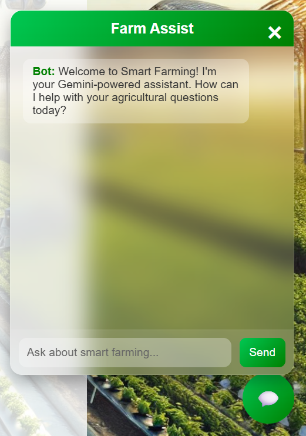

# 🌿 Smart Greenhouse System

A smart embedded greenhouse system that automates environmental monitoring, weather forecasting, disease prediction, and remote control through a web interface. This project integrates Arduino, Raspberry Pi, a machine learning model, and cloud services to help farmers grow crops more efficiently.

---

## 🎬 Demo Video

> _Click above to watch the full system demonstration._

---

## 📸 Project Screenshots

### 🧠 Chatbot for Agricultural Help

> Gemini-powered chatbot to assist farmers with agricultural queries in natural language.

---

### 📊 Dashboard Monitoring

> Real-time sensor readings of temperature, humidity, light intensity, and soil moisture.

---

### 🔌 Farm Control System

> Control irrigation and fan systems remotely using relays and Raspberry Pi.

---

### 🌾 Disease Prediction Model

> Upload leaf images to detect crop diseases using a trained CNN model.

---

### 🌦️ Weather Forecast Integration

> Fetches and displays weather forecast using Google Weather API for predictive control.

---

### 💻 Web Interface

> Easy-to-use web UI built with HTML/CSS/JS for farmers to interact with the system.

---

### 🏡 Implemented Greenhouse Prototype

> Actual prototype built using sensors, relays, camera, and a greenhouse structure.

---

## 🌟 Key Features

- 📡 Real-time sensor monitoring
- 🧠 AI-powered disease prediction via leaf images
- 🌦️ Weather-based irrigation logic
- 🤖 Chatbot support using Gemini AI
- 📷 Live camera monitoring
- 📊 Web dashboard for visualization and control
- 💧 Automated control of water and ventilation systems

---

## 🧠 Technologies Used

| Category       | Technologies |
|----------------|--------------|
| Hardware       | Arduino UNO, Raspberry Pi, DHT11, LDR, Soil Moisture Sensor, Relay |
| Programming    | Arduino C++, Python, JavaScript |
| Web            | Flask, HTML, CSS, JS |
| Machine Learning | TensorFlow, OpenCV, CNN |
| APIs           | Google Weather API, Gemini AI |
| Design Tools   | Proteus 8 |

---

